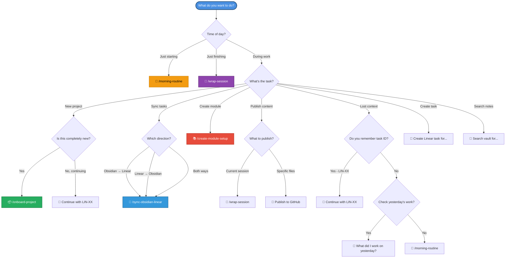

# Decision Tree: Which Command Should I Use?

A quick decision guide to help you choose the right workflow at any moment.

---

## 🎯 Decision Flowchart



---

## 📋 Scenario-Based Guide

### Scenario 1: Starting Your Day
```
Question: Is this the first thing I'm doing today?
├─ YES → /morning-routine
│   └─ Pulls tasks, reviews yesterday, sets priorities
└─ NO → Are you resuming previous work?
    ├─ YES → "Continue with LIN-XX"
    └─ NO → Start new work naturally
```

---

### Scenario 2: Continuing Work
```
Question: Do you know which task you were working on?
├─ YES → "Continue with LIN-XX"
│   └─ AI loads full context automatically
└─ NO → Need to find context?
    ├─ Check yesterday → "What did I work on yesterday?"
    ├─ Check tasks → "Show my Linear tasks"
    └─ Full reset → /morning-routine
```

---

### Scenario 3: Starting Something New
```
Question: What are you starting?
├─ Completely new project → /onboard-project
│   └─ Creates git repo + Linear project + Obsidian folder
├─ New course module → /create-module-setup
│   └─ Sets up module structure for DE Zoomcamp
├─ New task for existing project → "Create Linear task for {task}"
│   └─ Creates task, optionally links to Obsidian
└─ New note → "Create note for {topic}"
    └─ Creates structured Obsidian note
```

---

### Scenario 4: Wrapping Up
```
Question: Ready to end your session?
├─ YES → /wrap-session
│   ├─ Analyzes git changes
│   ├─ Links Linear tasks
│   ├─ Creates session log
│   ├─ Recommends publish target
│   └─ Publishes to GitHub (with approval)
└─ NO → Still working
    └─ Continue naturally, wrap later
```

---

### Scenario 5: Tasks Not Syncing
```
Question: Where are your tasks out of sync?
├─ Created tasks in Obsidian daily note → /sync-obsidian-linear
│   └─ Creates Linear issues, adds [[LIN-XX]] links
├─ Completed tasks in Linear not showing in Obsidian → /sync-obsidian-linear
│   └─ Updates Obsidian checkboxes
└─ Both systems inconsistent → /sync-obsidian-linear
    └─ Bidirectional sync (Linear wins conflicts)
```

---

### Scenario 6: Publishing Content
```
Question: What do you want to publish?
├─ Current session log → /wrap-session
│   └─ Auto-detects publish target (90%+ confidence)
├─ Specific skill or files → "Publish {path} to GitHub"
│   └─ Routes to appropriate repo
├─ Blog post from session → "Publish to Dev.to"
│   └─ Creates blog post from session highlights
└─ Weekly summary → Run weekly_summary.py script
    └─ Aggregates week's sessions
```

---

### Scenario 7: Lost or Confused
```
Question: What's wrong?
├─ Don't remember what I was doing → /morning-routine
│   └─ Resets context with current priorities
├─ Can't find my notes → "Search vault for {topic}"
│   └─ Searches Obsidian vault
├─ Can't find my tasks → "Show my Linear tasks"
│   └─ Displays current tasks by status
├─ Forgot to log yesterday → /wrap-session
│   └─ Can wrap anytime, analyzes git history
└─ Tasks incomplete but need new direction → /morning-routine
    └─ Reassesses priorities
```

---

## 🚦 Quick Decision Rules

### ✅ Automatic Workflows (Use These!)
1. **Starting day** → `/morning-routine`
2. **Ending session** → `/wrap-session`
3. **New project** → `/onboard-project`
4. **Tasks not synced** → `/sync-obsidian-linear`

### 💬 Natural Language (For Everything Else)
1. **Continuing work** → "Continue with LIN-XX"
2. **Creating tasks** → "Create task for {description}"
3. **Searching notes** → "Search vault for {topic}"
4. **Getting context** → "What did I work on yesterday?"
5. **Publishing** → "Publish to GitHub"

---

## 🎯 The 3 Most Important Commands

If you only remember 3 things:

1. **`/morning-routine`** — Start every day with this
2. **`/wrap-session`** — End every session with this
3. **"Continue with LIN-XX"** — Resume work with context

Everything else is either:
- A natural language request
- A specialized workflow for rare occasions

---

## 🔍 Troubleshooting Guide

| Problem | Solution |
|---------|----------|
| "I forgot what I was doing" | `/morning-routine` or "Continue with LIN-XX" |
| "My tasks aren't in Linear" | `/sync-obsidian-linear` |
| "I forgot to log yesterday" | `/wrap-session` (works retroactively) |
| "I need to find an old note" | "Search vault for {topic}" |
| "I don't know my priorities" | `/morning-routine` |
| "I want to publish my work" | `/wrap-session` |
| "I started a new project mid-session" | `/onboard-project` |
| "I need context for a task" | "Continue with LIN-XX" |

---

## 📊 Command Frequency Guide

### Daily (Every Session)
- ✅ `/morning-routine` (1x per day)
- ✅ `/wrap-session` (1x per session)
- ✅ "Continue with LIN-XX" (multiple times)

### Weekly
- `/sync-obsidian-linear` (if not auto-syncing)
- Weekly summary script (Fridays)

### Monthly/Rarely
- `/onboard-project` (new projects)
- `/create-module-setup` (new course modules)
- `/setup-skills-cowork` (new workspaces)

---

## 🎓 Example Decision Paths

### Path 1: Normal Workday
```
09:00 → /morning-routine
09:15 → "Continue with LIN-45"
[Work for 2 hours]
11:30 → /wrap-session
[Lunch break]
14:00 → "Continue with LIN-46"
[Work for 3 hours]
17:00 → /wrap-session
17:15 → /sync-obsidian-linear
```

### Path 2: Starting New Project
```
10:00 → /onboard-project
       [Provide: "data-pipeline-v2"]
10:05 → Project created!
       [Files created, git initialized, Linear project ready]
10:10 → "Create task for setting up dependencies"
       [Task LIN-89 created]
10:15 → "Continue with LIN-89"
       [Start working with full context]
```

### Path 3: Lost Context
```
You: "What was I working on?"
AI: "Your last session was 2 days ago on LIN-45: BigQuery partitioning"

You: "Continue with LIN-45"
AI: [Loads context from Linear + Obsidian + Git]
    "Last session: Created partitioned table, blocker on clustering strategy"
    
[Work for a while]

You: /wrap-session
AI: [Creates log, publishes to de-zoomcamp-2026]
```

---

## 💡 Pro Tips

1. **Trust the defaults** — `/morning-routine` and `/wrap-session` handle 90% of your needs
2. **Task IDs are magic** — Always reference "LIN-XX" for auto-context loading
3. **Sync is smart** — `/sync-obsidian-linear` is bidirectional and safe
4. **Publish is confident** — 90%+ accuracy on which repo to use
5. **Natural language works** — If you're unsure, just ask naturally

---

## 🎯 Final Rule

**When in doubt:**
1. Start day: `/morning-routine`
2. During work: "Continue with LIN-XX"
3. End day: `/wrap-session`

Everything else is optional optimization! 🚀
