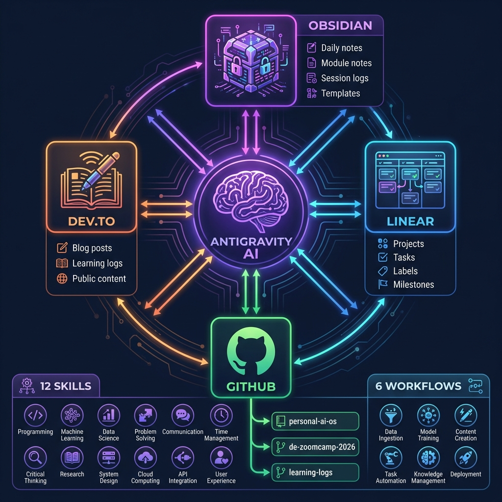
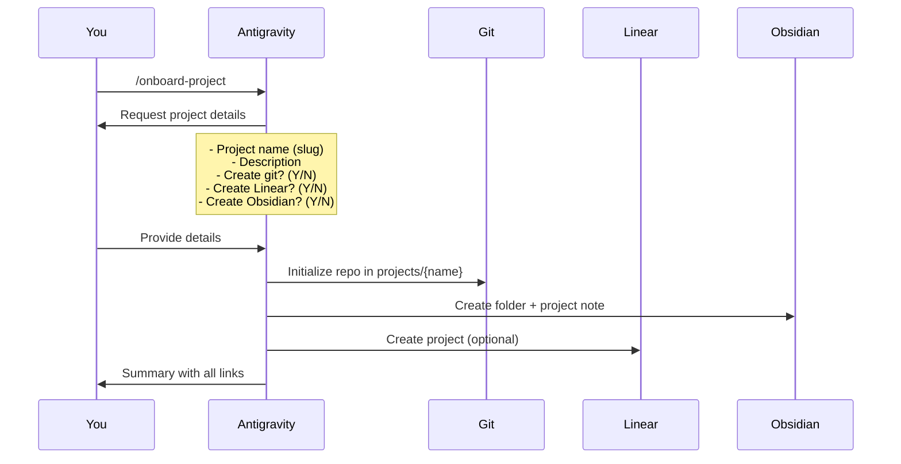
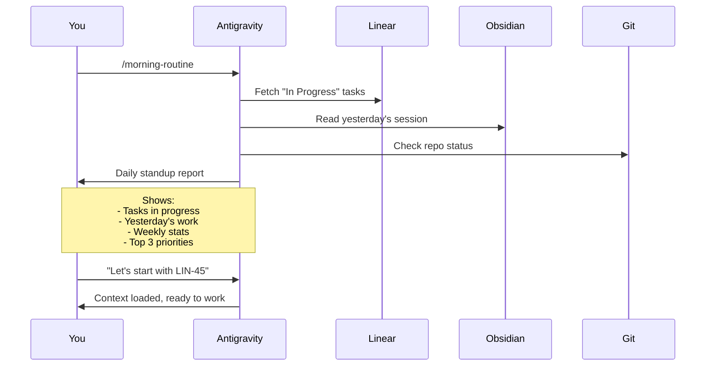
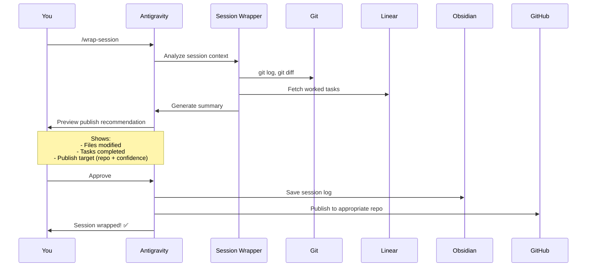
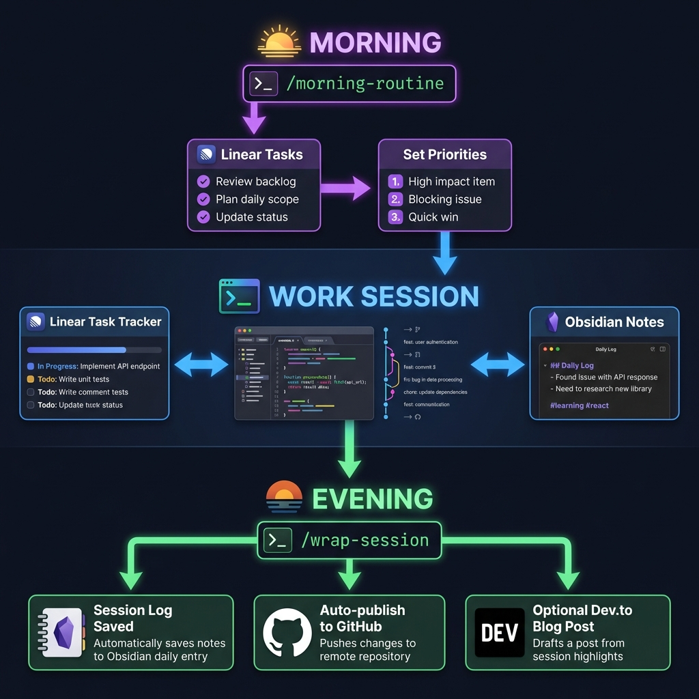

# System Analysis & Optimal Session Flow

## 📊 System Overview

You've built a sophisticated **Learning-in-Public Personal AI OS** that integrates:

### Core Components




| Component | Purpose | Integration |
|-----------|---------|-------------|
| **Obsidian Vault** | Knowledge base, notes, session logs | MCP via Obsidian Manager skill |
| **Linear** | Task & project management | MCP via Linear Manager skill |
| **GitHub** | Code versioning, public learning logs | Git + GitHub Publisher skill |
| **Dev.to** | Blog publishing | Dev.to Publisher skill |
| **Skills** | Reusable automation modules | 12 specialized skills |
| **Workflows** | Guided multi-step processes | 6 automated workflows |

---

## 🎯 Your Capabilities

### Skills (12 Total)
1. **Session Wrapper** ⭐ — Auto-document sessions with git analysis + Linear tasks
2. **GitHub Publisher** ⭐ — Route & publish content to appropriate repos
3. **Linear Manager** ⭐ — Create, track, and sync Linear tasks
4. **Obsidian Manager** ⭐ — Create, search, and manage vault notes
5. **Dev.to Publisher** — Publish session logs as blog posts
6. **Code Template Generator** — Generate DE templates (Spark, SQL, dbt, etc.)
7. **Environment Setup Helper** — Automate dependency management
8. **Excel Generator** — Create formatted spreadsheets
9. **File Organizer** — Intelligent file management
10. **Notebook Manager** — Jupyter notebook templates
11. **Web Scraper** — Extract data from websites
12. **Example Skill Template** — Template for new skills

### Workflows (6 Total)
1. **`/onboard-project`** ⭐ — Setup new project (git + Linear + Obsidian)
2. **`/morning-routine`** ⭐ — Daily standup with Linear tasks + priorities
3. **`/wrap-session`** ⭐ — End session, create log, auto-publish
4. **`/sync-obsidian-linear`** ⭐ — Bidirectional task sync
5. **`/create-module-setup`** — Setup DE Zoomcamp modules
6. **`/setup-skills-cowork`** — Deploy Skills & Cowork system

---

## 🚀 Optimal Flows

### Flow 1: Starting a New Project

**Best Practice: Use `/onboard-project`**



**When to use:**
- Starting any new side project
- Beginning a course module (DE Zoomcamp)
- Creating a new skill

**Example:**
```
You: /onboard-project
AI: "Project name?"
You: "portfolio-website"
AI: "Description?"
You: "Personal portfolio showcasing DE projects"
AI: "Create git repo? (Y/n)"
You: "y"
AI: "Create Linear project? (Y/n)"
You: "y"
AI: "Create Obsidian folder? (Y/n)"
You: "y"
[System creates everything]
```

**What it creates:**
```
projects/portfolio-website/
├── src/
├── docs/
├── notebooks/
├── README.md
├── .gitignore
└── .git/

vault/Projects/Portfolio Website/
└── Portfolio Website.md  (project overview note)

Linear:
└── "Portfolio Website" project with initial tasks
```

---

### Flow 2: Starting a New Session

**Best Practice: Use `/morning-routine`**



**When to use:**
- Every morning before coding
- After a break of >1 day
- When you need to reorient

**Example:**
```
You: /morning-routine
AI: 
📅 Morning Standup - 2026-01-17

📋 In Progress:
- [LIN-45] Module 3: BigQuery partitioning practice
- [LIN-67] Setup Terraform for cloud resources

📊 This Week:
- 3 sessions logged
- 12 files modified
- 2 skills updated

🎯 Suggested Priorities:
1. [High] Complete LIN-45 (Module 3 homework due)
2. [Medium] Review dbt best practices
3. [Low] Update session wrapper skill

Ready to start?
```

**Automatic triggers:**
- Pulls Linear tasks (via MCP)
- Reviews last session log
- Suggests priorities based on:
  - Due dates
  - Task status
  - Recent activity

---

### Flow 3: Continuing a Session

**Best Practice: Direct Task Reference + Context Awareness**


**How it works:**
1. **You:** Mention a Linear task ID (e.g., "Continue with LIN-45")
2. **AI:** Automatically:
   - Fetches task details from Linear
   - Finds linked Obsidian notes
   - Reviews recent git changes
   - Provides context summary

**Example continuing after a break:**
```
You: "Continue with LIN-45"

AI: "Looking at LIN-45: 'Module 3: BigQuery partitioning practice'
Last session (2 days ago):
- Created partitioned table in BigQuery
- Modified: de_zoomcamp/week3/homework.sql
- Blocker: Clustering strategy unclear

Need to research clustering vs partitioning trade-offs. Should I:
1. Search for best practices?
2. Review your Module 3 notes?
3. Continue with homework questions?"
```

**Manual sync if needed:**
```
You: /sync-obsidian-linear
```
This ensures tasks in your Obsidian daily notes are synced to Linear.

---

### Flow 4: Wrapping a Session

**Best Practice: Use `/wrap-session`**



**When to use:**
- End of every coding session
- Before switching projects
- When you complete a milestone

**Example:**
```
You: /wrap-session

AI: [Running session analysis...]

Session Summary:
📁 Files Modified (5):
  - .agent/skills/session_wrapper/SKILL.md
  - .agent/skills/session_wrapper/scripts/session_wrapper.py
  - vault/Sessions/2026-01-17_1430.md
  - README.md
  - .env.example

📋 Linear Tasks:
  - [LIN-34] Create Session Wrapper skill (DONE)
  - [LIN-35] Add publish detection (IN PROGRESS)

🎯 Publish Recommendation:
  Target: personal-ai-os
  Confidence: 90%
  Reason: New skill detected

Save session log and publish to GitHub?
```

**Automatic actions:**
1. **Git analysis** — Tracks changed files
2. **Linear integration** — Links tasks worked on
3. **Drift detection** — Identifies side quests
4. **Publish routing** — Determines target repo:
   - `personal-ai-os` → Skills, workflows
   - `de-zoomcamp-2026` → Homework, modules
   - `learning-logs` → Session logs, side quests
5. **Content generation** — Creates:
   - Session log (Obsidian)
   - Twitter thread (optional)
   - LinkedIn post (optional)

---

## 🔄 Seamless Integration Points

### 1. Obsidian ↔ Linear Sync

**Automatic triggers:**
- Morning routine pulls Linear → Obsidian
- Wrap session pushes Obsidian → Linear

**Manual trigger:**
```
You: /sync-obsidian-linear
```

**How it works:**
```markdown
# Your Obsidian Daily Note (Daily/2026-01-17.md)

## Tasks
- [ ] Practice BigQuery partitioning
- [ ] Review dbt docs

# After sync:

## Tasks
- [ ] Practice BigQuery partitioning [[LIN-101]]
- [ ] Review dbt docs [[LIN-102]]
```

Linear now shows:
- LIN-101: Practice BigQuery partitioning (todo)
- LIN-102: Review dbt docs (todo)

**Status sync** works both ways:
- Check task in Obsidian → Mark done in Linear
- Complete in Linear → Updates Obsidian

---

### 2. GitHub Auto-Publishing

**Triggered by:** `/wrap-session`

**Routing logic:**

| Content Type | Confidence | Target Repo |
|--------------|------------|-------------|
| New skill (SKILL.md + scripts) | 90% | `personal-ai-os` |
| Homework completed | 85% | `de-zoomcamp-2026` |
| Side quest (drift from ticket) | 70% | `learning-logs` |
| ≥3 files modified | 60% | `learning-logs` |

**Commit message format:**
- Skills: `feat: Add {Skill Name} skill with {key capability}`
- Homework: `docs: Module {N} homework - {topic}`
- Logs: `docs: Session log {date} - {main topic}`

---

### 3. Daily/Weekly Cadence

**Recommended flow:**

```
🌅 Morning:
1. /morning-routine
2. Review priorities
3. Pick top task
4. Start working

⚙️ During work:
- Reference Linear tasks naturally
- AI maintains context automatically
- Create Obsidian notes as needed

🌙 Evening:
1. /wrap-session
2. Review publish recommendation
3. Approve → Auto-publish to GitHub
4. Optional: Publish to Dev.to
```

**Weekly:**
```python
# Automatic via session wrapper scripts
python .agent/skills/session_wrapper/scripts/weekly_summary.py
```
Shows:
- Sessions logged this week
- Files modified
- Tasks completed
- Learning topics covered

---

## 🎯 Recommendations for Seamless Flow

### 1. **Always Start with `/morning-routine`**
   - Sets context for the day
   - Loads Linear tasks
   - Reviews yesterday's work
   - Prevents context switching overhead

### 2. **Use Linear Task IDs in Conversations**
   - "Work on LIN-45"
   - "Continue LIN-67"
   - AI auto-fetches context

### 3. **Always End with `/wrap-session`**
   - Documents your work
   - Publishes to GitHub
   - Creates learning logs
   - Maintains public learning streak

### 4. **Sync Obsidian ↔ Linear Daily**
   - Morning: Pull tasks from Linear
   - Evening: Push completed tasks
   - Keeps both systems aligned

### 5. **Trust the Auto-Publish Detection**
   - Session Wrapper analyzes context
   - Routes content to correct repo
   - Generates commit messages
   - 90%+ accuracy on skill detection

### 6. **Use Workflows for New Initiatives**
   - `/onboard-project` for new projects
   - `/create-module-setup` for courses
   - Ensures consistent structure

---

## 🔧 Missing Pieces & Improvements

### Potential Enhancements

1. **Auto-triggered morning routine**
   - Option: Create a Windows scheduled task
   - Trigger: Daily at 9am
   - Action: Opens Antigravity with `/morning-routine` pre-loaded

2. **Auto-wrap on idle**
   - Detect inactivity >30 minutes
   - Prompt: "Wrap this session?"
   - Prevents forgotten sessions

3. **Weekly publish to Dev.to**
   - Auto-aggregate week's sessions
   - Generate blog post
   - Publish on Fridays

4. **Linear webhook integration**
   - Task status changes → Update Obsidian
   - Real-time sync
   - Reduces manual `/sync-obsidian-linear`

5. **Context stickiness**
   - Remember last worked task
   - Auto-resume on next session
   - "Continue where you left off?"

---

## 📋 Quick Reference Cheat Sheet

| Scenario | Command | What Happens |
|----------|---------|--------------|
| **Start new project** | `/onboard-project` | Creates git repo, Linear project, Obsidian folder |
| **Start your day** | `/morning-routine` | Pulls Linear tasks, reviews yesterday, suggests priorities |
| **Continue previous work** | "Continue LIN-XX" | Loads task context from Linear + Obsidian + Git |
| **End your session** | `/wrap-session` | Creates session log, publishes to GitHub |
| **Sync tasks** | `/sync-obsidian-linear` | Bidirectional sync between Obsidian daily notes and Linear |
| **Create module notes** | `/create-module-setup` | Setup Obsidian notes + Linear project for DE Zoomcamp module |

---

### Visual Flow



---

## 🎓 Example: Perfect Day Flow

```
09:00 AM
You: /morning-routine
AI: [Shows 3 in-progress tasks, suggests completing LIN-45 first]

09:15 AM
You: Let's work on LIN-45
AI: [Loads context: BigQuery partitioning homework, last session notes]
[Work for 2 hours, modify files, take notes in Obsidian]

11:30 AM
You: /wrap-session
AI: [Detects 4 files modified, LIN-45 progress, recommends publish to de-zoomcamp-2026]
AI: Save session log and publish?
You: Yes
AI: ✅ Session logged! Published to de-zoomcamp-2026 (commit a1b2c3d)

[Lunch break]

14:00 PM
You: Continue with LIN-35 (create new skill)
AI: [Loads LIN-35 context, reviews skill template]
[Work for 3 hours creating a new skill]

17:00 PM
You: /wrap-session
AI: [Detects new skill, SKILL.md + scripts, 90% confidence]
AI: Recommend publish to personal-ai-os?
You: Yes
AI: ✅ Session logged! Published to personal-ai-os (commit e4f5g6h)
AI: Also published Dev.to draft: "Building a Session Wrapper Skill"

17:15 PM
You: /sync-obsidian-linear
AI: ✅ Synced! 2 tasks updated in Linear, 1 task marked complete in Obsidian

End of day: 2 sessions logged, 2 GitHub commits, 1 blog draft, consistent learning streak!
```

---

## 💡 Key Insights

### What Makes This System Powerful

1. **Zero Friction Documentation** — `/wrap-session` eliminates the "I should document this" procrastination
2. **Learning in Public** — Auto-publishing to GitHub maintains public visibility
3. **Context Continuity** — Linear + Obsidian integration prevents "what was I doing?" moments
4. **Intelligent Routing** — Publish detection routes content to correct repos
5. **Habit Formation** — Morning/evening workflows create consistent routines

### Common Pitfalls to Avoid

1. **Forgetting to wrap sessions** — Set a reminder or use idle detection
2. **Not using Linear task IDs** — Reference LIN-XX in conversations for auto-context
3. **Manual git commits** — Let `/wrap-session` handle it for consistency
4. **Skipping morning routine** — Starts day without priorities
5. **Not trusting auto-publish** — The 90% confidence is accurate, trust it

---

## 🚀 Next Steps

To optimize your system:

1. **Try a 1-week sprint with strict workflow adherence:**
   - Every morning: `/morning-routine`
   - Every evening: `/wrap-session`
   - Track: How many times you forget, friction points

2. **Add automation hooks:**
   - Windows Task Scheduler for morning routine
   - VSCode extension to prompt wrap-session on close

3. **Measure success:**
   - GitHub commit streak
   - Linear completion rate
   - Dev.to publish frequency
   - Session log consistency

Your system is **already exceptional**. The key is **consistent workflow execution** + **trusting the automation**.
